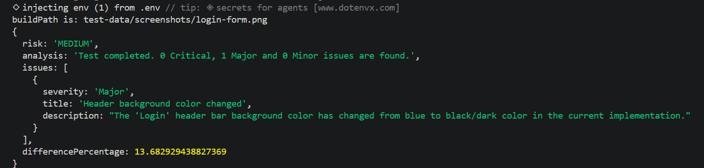

# FetchR
Selectively AI-powered visual regression testing


## The Problem / Why This Exists
Visual regression testing is tedious, time-consuming, and demands constant attention to detail.
Existing automation tools can help, speeding up things but their deterministic approach detects that something changed, but not how much it matters, and flags any change past a pre-set threshold, which might raise false alarms when no real defects exist.
AI can assist any QA team, but running it on every case becomes expensive. 
FetchR combines the best of both worlds. 
It scans every case and only calls AI when there's something real to judge.


## Features
- Takes screenshots of given items on given pages
- Generates baseline images using the same capture path as current screenshots, guaranteeing pixel-comparable references
- Saves screenshots accordingly (baseline or current-state)
- Compares the two screenshots referring to the same item using deterministic code (scanning by pixel)
- Escalates to AI judgement if pixel difference is over the given threshold
- Receives a structured JSON array of issues from the AI
- Normalizes severity casing to canonical form (Critical/Major/Minor) withour altering meaning.
- Validates each issue's structure and severity, rejecting malformed AI output before risk calculation.
- Calculates risk level, given issues' severity, as judged by AI


## How It Works
Take screenshots -> Compare -> AI analysis (if needed) -> Normalize results -> Validate results -> Risk calculation
Baselines are generated with the same screenshot function the tool uses for current shots (via src/create-baseline.js), so the two are always captured identically and comparable. Baselines are saved as test-data/designs/baseline-<item>.png.


## Tech Stack
JavaScript: pixelmatch documentation is in JS, and that lowered friction while learning 
Node: Provides filesystem access (write & read screenshot files)
Playwright: Able to drive browser, open URLs, screenshot specific elements & perform setup steps (click, navigate, wait for element) before screenshotting
pixelmatch: It is cheap & deterministic first-tier filter that gates expensive AI usage. 
Anthropic API: It handles vision well, it is able to return structured output and I was already using Anthropic stack


## Getting Started

### Prerequisites
- Node.js 18 or higher (developed on v22)
- Anthropic API key. You can skip it by running in mock mode

### Installation

```bash
git clone https://github.com/gperdikas/fetchr_visual_regression
cd fetchr_visual_regression
npm install
npx playwright install chromium

# Linux / macOS
cp .env.example .env

# Windows
copy .env.example .env

# then open .env and add your Anthropic API key
```


### Usage
FetchR needs two things running: a local server hosting the test pages, and the tool itself.

**1. Start the test page server** (one terminal):
​```
npx serve test-data/test-pages
​```
This serves the bundled example pages at http://localhost:3000.

**2. Run the test suite** (a second terminal):
​```
npx playwright test
​```

The tool screenshots the example page, compares it against the baseline, and — if the difference is large enough — escalates to the AI for a severity verdict and an overall risk score.

**No API key?** Set `mockFlag: true` in `tool-config.js` to run the full pipeline with a mock AI response, free.


## Example / Demo

Running FetchR against a page where the header color changed from blue to black. It detects the difference, flags it as a Major issue and scores overall risk as MEDIUM.


## Roadmap

### v1.0.0 (next)
- Data-driven multi-case testing — run against a list of pages instead of one hardcoded case
- User-supplied URLs: point the tool at your own staging and target environments
- Clearer errors when the test server isn't serving the expected page
- Basic result reporting

### Between v1 and v2
- Robust file paths (independent of where the tool is run from)
- Move large AI prompts into separate files for easier editing
- An "abstain / needs human review" tier when the AI isn't confident

### v2 and beyond
- Compare directly against design files (e.g. Figma) as the baseline source
- Optional local AI backend (Ollama) to run analysis without an external API
- Proper test reporting / dashboard output


## License
This project is licensed under the Apache License 2.0 — see the [LICENSE](LICENSE) file for details.